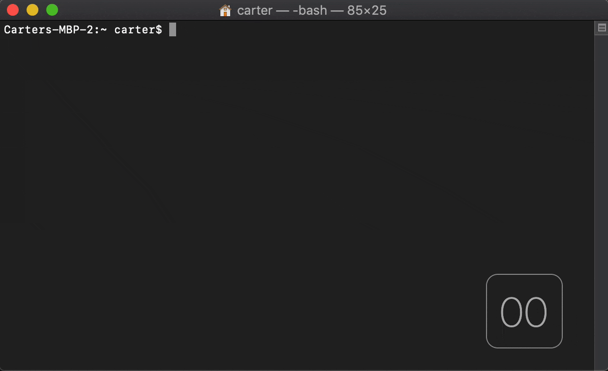

<p align="center">
  <br>
  <a href="https://github.com/eosrapid/adappt" target="_blank"></a>
</p>


# Adappt IDE
<p align="center">
  <a href="https://www.youtube.com/watch?v=tHeiB3OqWp8" target="_blank"></a>
  <br>
</p>

Welcome to the official **Adappt** source code repository! 

**Adappt** is fully featured IDE that allows for the rapid development, testing, and deployment of EOSIO smart contracts. Unlike other EOSIO development solutions that require you to go through a lengthy installation process or requires you to compile your code on someone else server, Adappt runs completely on your own machine and can be installed from scratch in [less than a minute](#installStep1).

### TLDR: Why you should use Adappt
1. Downloads and installs in less than 60 seconds on modern PCs
2. Docker is the only dependency
3. Includes an easy to use UI that makes writing, compiling and deploying EOSIO smart contracts a breeze.
4. Runs locally on your machine, no risk of 3rd parties modifying your smart contract's code (we don't trust gitpod either).
5. Adappt is an IDE for building EOSIO-compatible smart contracts, and EOSIO blockchains process [more daily transactions than all other public blockchain combined](http://archive.is/YAAi4).


# How to Get Started

### *[Watch the tutorial and learn how to go from 0 to deployed contract in under 10 minutes!](https://www.youtube.com/watch?v=tHeiB3OqWp8)*

The best way to get started is by watching our [8 minute full tutorial](https://www.youtube.com/watch?v=tHeiB3OqWp8) that walks you through installing **Adappt** from scratch, creating your first smart contract, and deploying/testing the smart contract on Jungle Testnet.

## Getting started with **Adappt** in 5 easy steps

<h3 id="installStep1">Step 1: Install and launch Adappt by running the command below in your terminal of choice.</h3>

```bash
docker run --rm -p 3000:3000 eosrapid/adappt:1.4.0
```


<h2> </h2>

### Step 2: Visit http://localhost:3000 in your web browser, and click on "Create New Project..." to create a new smart contract.
***NOTE: Choose a project name using the characters a-z. Keep it under 10 characters and don't use any spaces, uppercase letters or numbers!***

<h2> </h2>

### Step 3: Click on your newly created project in the list to open it

<h2> </h2>

### Step 4: Edit your code using the IDE, and then *click on the yellow crown* at the top of the page when you are ready to compile your contract


<h2> </h2>

### Step 5: Once your code has compiled, click on the "Deploy Contract" button to deploy your contract to the EOSIO blockchain of your choice! 

---
# Repos

* ### [Adappt Frontend Repo](https://github.com/eosrapid/addapt-frontend)
* ### [Adappt Backend Repo](https://github.com/eosrapid/workflow-compiler-server)

License
----
MIT License

Copyright (c) 2020 EOS Rapid (https://eosrapid.com)

Permission is hereby granted, free of charge, to any person obtaining a copy
of this software and associated documentation files (the "Software"), to deal
in the Software without restriction, including without limitation the rights
to use, copy, modify, merge, publish, distribute, sublicense, and/or sell
copies of the Software, and to permit persons to whom the Software is
furnished to do so, subject to the following conditions:

The above copyright notice and this permission notice shall be included in all
copies or substantial portions of the Software.

THE SOFTWARE IS PROVIDED "AS IS", WITHOUT WARRANTY OF ANY KIND, EXPRESS OR
IMPLIED, INCLUDING BUT NOT LIMITED TO THE WARRANTIES OF MERCHANTABILITY,
FITNESS FOR A PARTICULAR PURPOSE AND NONINFRINGEMENT. IN NO EVENT SHALL THE
AUTHORS OR COPYRIGHT HOLDERS BE LIABLE FOR ANY CLAIM, DAMAGES OR OTHER
LIABILITY, WHETHER IN AN ACTION OF CONTRACT, TORT OR OTHERWISE, ARISING FROM,
OUT OF OR IN CONNECTION WITH THE SOFTWARE OR THE USE OR OTHER DEALINGS IN THE
SOFTWARE.
